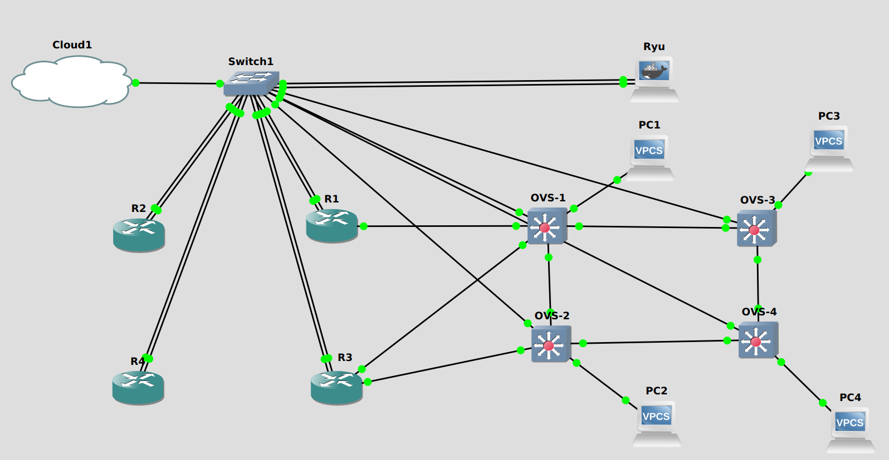
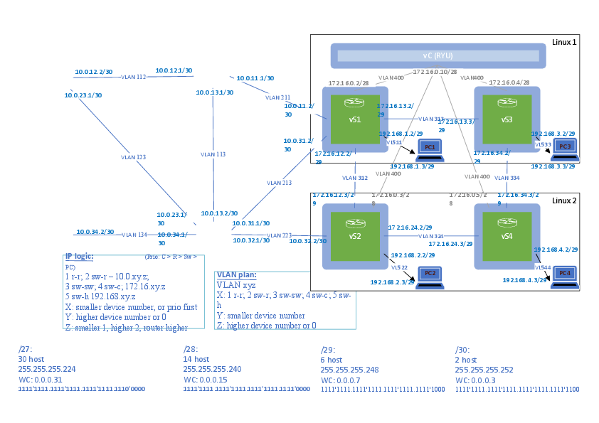
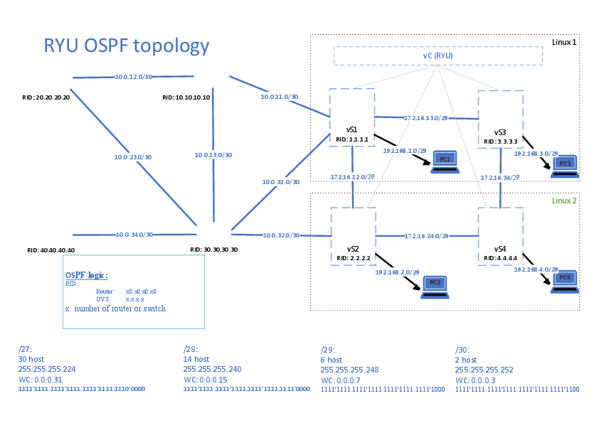

# GNS3 környezet

A korábbi Szabó Csaba féle topológiát követve implementáltuk GNS3-ban, amely logikájában (VLAN-ok)
megegyezik az eredeti topológiával, azonban megvalósításban eltér attól.

Minden router egy ethernet switchbe van bekötve, amelyhez csatlakozik a Ryu kontroller is, valamint
azon OVS-ek, amelyek logikailag routerekhez vannak kötve. Az ethernet switchbe csatlakozik még a
`Cloud1`, amely a GNS3-beli "internet" hozzáférést biztosítja annak `virbr0` interfészén keresztül
a `192.168.122.1/24` IP címen.

A GNS3 környezetben nincs szükség a 2 Linux VM-re, mert jelen környezet dockerben futtat sok imaget,
pl. a Ryu-t, OVS-eket, ezáltal kisebb a komplexitás, könnyebb a management, mint pl. file felmásolása,
terminálba/ból másolás stb.

A router konfigok mentve vannak az eszközön. A Ryu és OVS konfigok mentése egyenlőre nem megoldott,
ezeken minden indulásnál ki kell adni a parancsokat (erről részletek lejjebb, az adott eszköznél).

## Topológia:

GNS3

L3

OSPF

## Konfigurációs fileok:
- R1 config.txt
- R2 config.txt
- R3 config.txt
- R4 config.txt
- OVS1_config.sh
- OVS2_config.sh
- OVS3_config.sh
- OVS4_config.sh
- RYU_config.sh

## Cloud1:

internet

`virbr0` interfész: `192.168.122.1/24`

## Ethernet Switch 1:

sok port (pl 50)

mindegy, mit hova kötünk benne, "buta switch"

## 4 db Cisco router:

shady helyről van az image

Cisco 3725 124-25.T14

configok githubon

switchen keresztül kommunikálnak, nincs P2P

- `f0/0`: vlanok, egymással sikeresen kommunikálnak

- `f0/1`: wan port, itt a `192.168.122.0/24` hálózaton kommunikálnak a `Cloud1`-gyel, valamint
mindenkivel ezen a hálózaton

Az R1 és R3 routeren továbbá nem VLAN kapcsolat van az OVS1 és OVS2 közt, hanem LAN, azaz nem subinterface-re, hanem interface-re adtunk IP címet. Az OVS-eknél is LAN van, nem VLAN. Ennek érdekében az említett 2 routerhez hozzá lett adva további interface (`jobb egér/Configure/Slots/Adapters/NM-1FE-TX`)

Itt a port leosztás:
- R1 F1/0 <-> OVS-1 ETH6
- R3 F1/0 <-> OVS-1 ETH7
- R3 F2/0 <-> OVS-3 ETH7

Korábbi konfighoz képesti változás:
- vlan999 nincs, helyett a `f0/1` lát a netre
- default-gw nincs
- default dns sincs
- ospf router id van

## Docker container file copy and run:

A GNS3 lehetővé teszi konténerek futtatását, azokat előlünk teljesen elfedve (transzparens módon), számunkra önálló eszközként megjelenítve. A konténerekkel így fileokat is meg tudunk osztani. Ennek egyik módja a shared folder, mely megosztási mód részletei az alábbiak:
- az eszközön (pl OVS) `jobb egér/Configure/Advanced/ itt a megfelelő mezőbe elnevezünk egy mappát` (többet is lehet)
- fontos, hogy az eszköz (konténer) ki legyen kapcsolva
- a létrehozott mappát az eszköz elindítása után a `/gns3volumes` könyvtárban találjuk
- a megosztott könyvtárba bemásolni az alábbi módon tudunk:
  - `jobb egér/ Show in file manager`
  - itt kézzel bemásoljuk az általunk létrehoz mappába a tartalmat
- ezek után még meg kell adni (az eszköz elindítása után) a megfelelő jogokat a felmásolt állománynak (pl. futási jog)

A megosztott mappában található tartalom nem veszik el a konténer leállása után sem, és a beállított jogok is megmaradnak.

## Ryu és OVS inicializálás

A perzisztens memóriával nem rendelkező eszközöket elindítás után inicializálni kell.
Ez megtehető eszközönként kézzel (a [Ryu](#ryu-kontroller) illetve az [OVS](#OVS-switchek) fejezetek végén kifejtett módon),
vagy a `network_init.sh` script segítségével automatikusan.

A script a GNS3-ban már létrehozott és futó konténerekbe belép `telnet` segítségével és lefuttatja a már felmásolt
inicializáló scripteket a Ryu kontrolleren és az OVS switcheken.

A kontoroller esetében az inicializáláson felül bemásolja a konténerhez felcsatolt kódokat a `ryu/ryu/app` mappába.

## Ryu kontroller:

2 interfésze van:
- `eth0`:
  - az SDN management lan (VLAN400)
  - `172.16.0.10/28`
  - ezen keresztül kommunikál az OVS-ekkel
- `eth1`:
  - "internet" lan, ezen keresztül közvetve (`Cloud1`) lát ki az internetre
  - azért van rá szükség, mert bizonyos eszközöket (pl. python) telepíteni kellett rá

A konténer és a host (GNS3) megosztott mappájába bemásoljuk a `RYU_config.sh` scriptet (részletezeve [itt](#docker-container-file-copy-and-run)). Eztután a `./../gns3volumes/ryu_code/RYU_config.sh` scriptet futtatva kész az eszköz konfigurálása.

## OVS switchek:

- egymás közt VLAN-okon kommunikálnak
- közvetlen kapcsolat, nem ethernet switchen keresztül
- az ethernet switchen keresztül kommunikálnak azok az OVS-ek, amelyek routerekkel is kapcsolatban vannak
- nincs közvetlen internet hozzáférésük
- az `eth0` interfész mindegyik az SDN management lan, ez is az ethernet switchbe van kötve
- az `eth5` interfész mindegyik az SDN és a hozzá tartozó VPCs közti kapcsolat portja
- OVS port leképezés:
  - " eth x goes to ovs x " szerint, azaz az aktuális OVS `eth*` interfésze a szomszédos `OVS*` felé
  van kötve, ahol a `*` a port/OVS száma
  - pl. `OVS1` `eth2` interfésze az `OVS2` `eth1` interfészébe csatlakozik
- a `br0` OVS bridge default tartalmazza az összes `eth*` interfészt, nem kell külön hozzáadni
- a routerekkel összekötött OVS-ek port kiosztása:
  - `R3`-ba az `eth7` megy mindkét OVS-ről
  - `R1`-be az `eth6` megy az OVS1-ből

A konténer és a host (GNS3) megosztott mappájába bemásoljuk a `OVS*_config.sh` scriptet (részletezeve [itt](#docker-container-file-copy-and-run)), ahol a `*` az ovs számát jelöli. Eztután a `./gns3volumes/init_script/OVS*` scriptet futtatva kész az eszköz konfigurálása. 

FIGYELEM: a futtatási parancs helyesen lefut minden OVS-en a saját, általunk felmásolt konfiggal, azonban a teljes parancs így néz ki (pl az OVS1-en): `./gns3volumes/init_script/OVS1_config.sh`. Ezzel is ugyan az a script fut, de ekkor figyelni kell minden OVS-en, hogy a megfelelő parancsot adjuk ki, ahol az OVS száma helyes.

## VPCs:

- a hostokat a GNS3 VPCs (Virtual PC simulator) nodejaival oldottuk meg
- mindegyik PC a hozzá tartozó OVS `eth5` portjához csatlakozik
- a PC-k megtartják konfigurációjukat leállítás után is a `save` parancs kiadása után
- példa konfiguráció (a PC1-en):
- - `ip 192.168.1.3/29`
- - `save`

### A környezet kialakításához használt hasznos linkek:
- set port vlan tag: https://medium.com/@arrosid/vlan-configuration-on-open-vswitch-83459d8c0cfc
- set port ip address: https://docs.openvswitch.org/en/latest/faq/vlan/
- https://docs.gns3.com/docs/using-gns3/advanced/connect-gns3-internet/
- https://www.yourictmagazine.com/howtos/434-basics-to-configure-a-cisco-router-to-connect-to-internet
