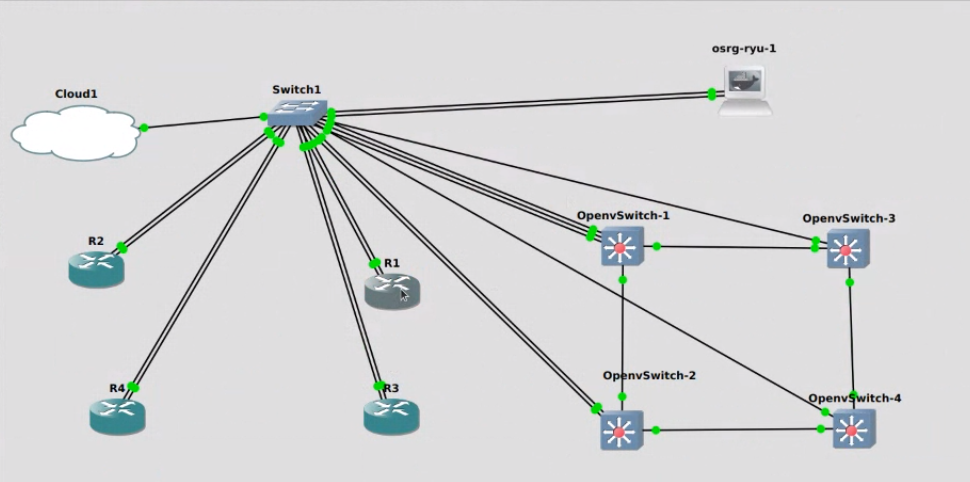

# [Szakdolgozat](thesis_szabo_csaba.pdf) 

---

### [OneDrive](https://bmeedu-my.sharepoint.com/personal/dengyel_b_edu_bme_hu/_layouts/15/onedrive.aspx?id=%2Fpersonal%2Fdengyel_b_edu_bme_hu%2FDocuments%2FÖnlab&ga=1)

---

## GNS3 topológia

---

### TODOs
- Ryu alpineban
- új topológia doookumentálni + rajz (GNS3_NW_topo.txt)

---

más megoldások
- IPVLAN? (pls no)
- https://www.youtube.com/watch?v=bKFMS5C4CG0
- https://gist.github.com/bbl/dad5ea94cdf8f384bb7a47dd4869b2eb
- https://www.youtube.com/watch?v=nGSNULpHHZc&ab_channel=Docker

 

### Ryu::
- ip cím konfig: 192.168.122.111
- default route
- dns konfig
- ezután apt update + többi cucc ryu_init.sh-ból

File felmásolás ryura:
- ryu configban (gns3) létrehozni shareed foldert
- jobb klikk, file manager
- itt berakni shared folderbe a cuccokat
- ryuból ezeket eléred a gns3volumes mappában

### Internet GNS 3:
- cloud (virbr0 interfész)
- router
- ezek összekötnni
- dhcp címet kérni
- natolás
- https://docs.gns3.com/docs/using-gns3/advanced/connect-gns3-internet/
- https://www.yourictmagazine.com/howtos/434-basics-to-configure-a-cisco-router-to-connect-to-internet

 

---

https://www.hit.bme.hu/edu/project/data?id=19952

https://www.hit.bme.hu/edu/project/data?id=19938

 

### Ansible (megnézni)
- tutorial a weboldalon
- dc linkek kurzushoz (Böősy Pali?)
- https://developer.cisco.com/learning/labs/ansible-02_ansible-intro/introduction-to-ansible/
- https://developer.cisco.com/learning/labs/ansible-overview/introduction/

 

egy felső réteg az sdn controllernek és az asic-eknek is

hibrid hálózatok utánanézni

ieee xplore cikkek (VPN-nel)
- https://ieeexplore.ieee.org/document/8360763 (LE VAN TÖLTVE!)

dokumentálni (heti haladás)

---

## Linkek nagyobb fájlokhoz (50+ MB)

- [szakdoga.gns3project](https://bmeedu-my.sharepoint.com/personal/dengyel_b_edu_bme_hu/_layouts/15/onedrive.aspx?id=%2Fpersonal%2Fdengyel%5Fb%5Fedu%5Fbme%5Fhu%2FDocuments%2F%C3%96nlab%2Fszakdoga%2Egns3project&parent=%2Fpersonal%2Fdengyel%5Fb%5Fedu%5Fbme%5Fhu%2FDocuments%2F%C3%96nlab)
