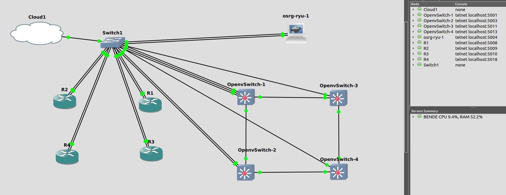

# [Szakdolgozat](thesis_szabo_csaba.pdf) 

---

### [OneDrive](https://bmeedu-my.sharepoint.com/personal/dengyel_b_edu_bme_hu/_layouts/15/onedrive.aspx?id=%2Fpersonal%2Fdengyel_b_edu_bme_hu%2FDocuments%2FÖnlab&ga=1)
[Marci önlab kiírás](https://www.hit.bme.hu/edu/project/data?id=19938)
 
[Bende önlab kiírás](https://www.hit.bme.hu/edu/project/data?id=19952)

---

## Linkek nagyobb fájlokhoz (50+ MB)

- [GNS3 projekt fileok](https://bmeedu-my.sharepoint.com/:f:/g/personal/dengyel_b_edu_bme_hu/Epaqy3DbUINAujsJr4uuJrwB_lLvTGTR-QPHntcrUNYCig?e=ABxVVR)

---

## [GNS3 topológia](GNS3_NW_topo.md)

---

### TODOs
- PULL!!!
- MARCI: ryu működése
- BENDE: save conifg on OVS and Ryu
- következő teendők kitűzése
- projekt feltölteni
- COMMIT AND PUSH!!!